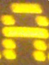

# POVDisplay

## What is it? 

This is code written for a [persistence of vision display](https://en.wikipedia.org/wiki/Persistence_of_vision#LED_POV_displays) powered by an Arduino Nano. The Arduino drives five LEDs which are rapidly updated to cause text to be displayed. 


The video framerate makes it look worse than it does in real life. 

## Hardware

### Electronics

All electronic connections were made using male-to-male jumper wires and a couple of tiny solderless breadboards. 
 
| Pin      | Component          |
| -------- | ------------------ |
| VIN      | 9V battery (+)     |
| GND      | 9V battery (-)     |
| D2 to D6 | LEDs               |
| D8       | hall effect sensor |

### Box fan

For a cheap solution, an old box fan was used for its motor. The front cover and fan blades were removed, and the motor shaft was threaded (which was very difficult given that it spins freely). The magnet to be sensed by the hall effect sensor was mounted inside the frame on one side so that the sensor passes by it every revolution. 

### Rotating platform

The rotating platform is an octogon of 1/8 inch MDF with a hole in the middle for it to be tightly bolted onto the motor shaft. 

All of the components (9V battery, breadboards, sensor) were attached to the platform using an abundance of both double-sided foam tape and hot glue. 

## Use

### Changing displayed text

The string of characters in `text[]` will be displayed. 

All characters represented by ASCII values 32 through 90 (capital letters, numbers, spaces, and these special characters: `!"#$%&'()*+,-./:;<=>?@`) are supported. 

### Making it go

To run the display: 
- Upload the program to the Arduino. 
- Make sure the Arduino is being powered by the battery. 
- Plug in the fan. 
- Verify that the platform can rotate freely without causing a disaster. 
- Turn on the fan motor at the desired speed &ndash; any speed works, but the faster the speed, the higher the "framerate" (and possibly the danger depending on how securely the components are mounted). 

## How does it work? 

As it may be guessed, this program is heavily realiant on precise timing. The amount of time each revolution takes is measured using the built-in `micros()` function and the hall effect sensor. The sensor is mounted on the rotating platform and is triggered each revolution by the magnet. Every time the sensor is triggered, the variables `timeStamp` and `prevTimeStamp` are used to calculate the value of `microsPerRev` (microseconds per revolution) for the previous revolution. This, along with the value of `spacing`, is used to calculate the amount of time to delay between drawing each "column" of LEDs. 

All of the display data is stored in `DisplayData::characters` in 5-by-5 boolean grids. These grids represent which LEDs need to be turned on and off to display each character. 

For example, here is the data to display the letter "A": 

```c
{
    {0, 1, 1, 1, 0},  // A
    {1, 0, 0, 0, 1},
    {1, 1, 1, 1, 1},
    {1, 0, 0, 0, 1},
    {1, 0, 0, 0, 1}
}
```

The 1s turn LEDs on, and 0s turn them off. When shown on the display, the letter "A" will look like this: 



The nested for loops in the main `loop()` function iterate through this data based on the characters in `text[]`. 
